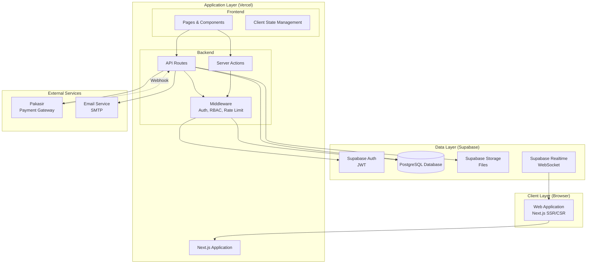
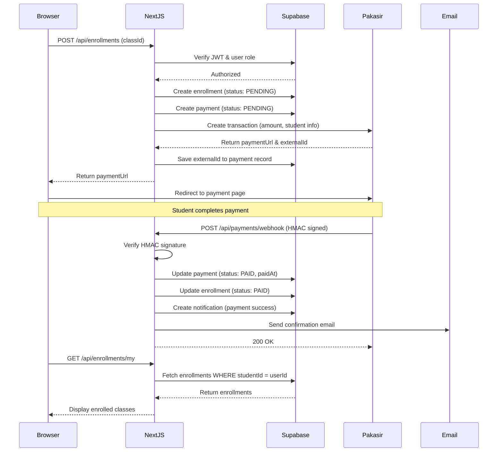
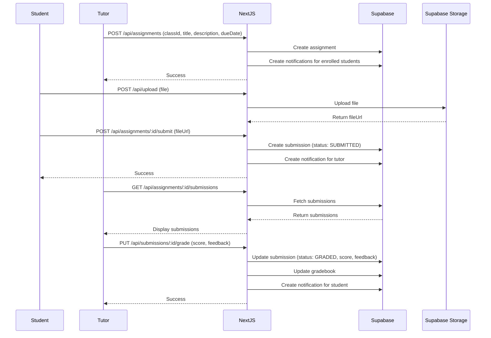
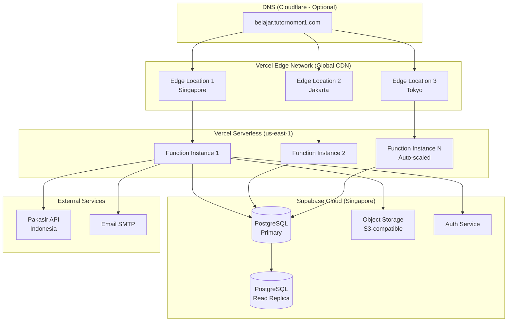
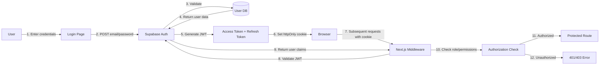
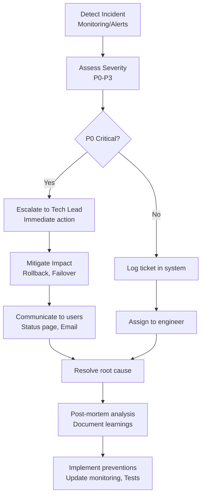

# High-Level Architecture Document
# Platform E-Learning Tutor Nomor Satu

**Version:** 1.0  
**Last Updated:** November 15, 2025  
**Document Owner:** Technical Architecture Team  

---

## 1. Executive Summary

This document provides a high-level overview of the E-Learning Platform architecture, including system components, data flow, infrastructure, and key design decisions.

### 1.1 Architecture Goals
- **Scalability**: Support growth from 100 to 10,000+ users
- **Performance**: Fast page loads (< 2s) and API responses (< 500ms)
- **Security**: Protect user data and prevent unauthorized access
- **Maintainability**: Clean, modular codebase for easy updates
- **Cost-Effectiveness**: Leverage free tiers and serverless architecture

---

## 2. System Architecture Overview

### 2.1 Architecture Pattern

**Pattern**: **Serverless Monolith** (Single Next.js application with modular structure)

**Rationale**:
- Simplifies deployment and reduces operational complexity
- Next.js App Router provides clear separation of concerns via route groups
- Serverless functions auto-scale without manual intervention
- Cost-effective for MVP and early growth



---

## 3. Architectural Layers

### 3.1 Presentation Layer (Frontend)

**Technology**: Next.js 15 App Router, React 19, TailwindCSS, Shadcn UI

**Responsibilities**:
- Render user interfaces (Server Components + Client Components)
- Handle user interactions
- Display data from API/Server Actions
- Client-side state management (minimal, prefer server state)

**Key Components**:
```
app/
├── (auth)/           # Authentication pages (login, register)
├── (dashboard)/      # Role-based dashboards (admin, tutor, student)
├── (public)/         # Public pages (catalog, landing)
└── api/             # API routes
```

**Design Pattern**: **Component-Based Architecture**
- Reusable UI components (Shadcn UI)
- Feature-specific components (ClassCard, AssignmentForm)
- Layout components (Holy Grail Layout)

---

### 3.2 Application Layer (Backend)

**Technology**: Next.js API Routes, Server Actions, Middleware

**Responsibilities**:
- Business logic execution
- Data validation (Zod schemas)
- Authentication and authorization (Supabase Auth + Middleware)
- API endpoint exposure (RESTful conventions)
- Integration with external services (Pakasir, Email)

**Key Components**:

#### 3.2.1 API Routes
```
app/api/
├── auth/            # Authentication endpoints
├── classes/         # Class management
├── enrollments/     # Enrollment & payment
├── assignments/     # Assignment CRUD & grading
├── quizzes/         # Quiz CRUD & taking
├── materials/       # Material upload/view
├── payments/        # Payment webhook
└── upload/          # File upload handler
```

#### 3.2.2 Server Actions
Used for form submissions and mutations (alternative to API routes for better DX)

```typescript
// Example: Create assignment server action
'use server'
export async function createAssignment(formData: FormData) {
  const session = await getServerSession()
  // Authorization check
  // Validate input with Zod
  // Create assignment in database
  // Return result
}
```

#### 3.2.3 Middleware
```typescript
// middleware.ts
export async function middleware(request: NextRequest) {
  // 1. Authentication check (JWT validation)
  // 2. Role-based authorization (RBAC)
  // 3. Rate limiting (via Upstash Redis)
  // 4. CSRF protection
  // 5. Security headers
}
```

**Design Pattern**: **Layered Architecture**
- Presentation → Application → Data
- Clear separation of concerns
- Testable business logic

---

### 3.3 Data Layer

**Technology**: Supabase PostgreSQL, Prisma ORM

**Responsibilities**:
- Persistent data storage
- Data integrity enforcement (constraints, foreign keys)
- Row-level security (RLS policies)
- Backup and recovery

**Database Schema**:
```
Core Tables:
- users (authentication via Supabase auth.users)
- student_profiles, tutor_profiles (user extensions)
- classes (course offerings)
- enrollments (student-class relationship)
- payments (payment records)

Content Tables:
- materials (learning resources)
- assignments, assignment_submissions
- quizzes, quiz_questions, quiz_attempts, quiz_answers
- live_classes (Zoom/Meet scheduling)

Communication Tables:
- forum_threads, forum_posts
- notifications

Audit Tables:
- audit_logs (admin actions tracking)
```

**Design Pattern**: **Database per Service** (Single database, but tables grouped by domain)

---

### 3.4 Integration Layer

**External Services**:

#### 3.4.1 Supabase Auth
- Purpose: User authentication and session management
- Integration: JWT tokens stored in httpOnly cookies
- Flow: User login → Supabase Auth → JWT → Middleware validates

#### 3.4.2 Supabase Storage
- Purpose: File storage (materials, submissions, profile pictures)
- Integration: Direct upload from client or via API route
- Structure:
  ```
  storage/
  ├── materials/       # Tutor-uploaded materials
  ├── submissions/     # Student assignment submissions
  └── profiles/        # Profile pictures
  ```

#### 3.4.3 Pakasir Payment Gateway
- Purpose: Process payments (QRIS, Virtual Account, E-Wallet)
- Integration: REST API + Webhook callback
- Flow:
  ```
  1. Student enrolls → Create payment via Pakasir API
  2. Pakasir returns payment URL
  3. Student completes payment on Pakasir page
  4. Pakasir sends webhook to /api/payments/webhook
  5. Verify signature → Update enrollment status → Grant access
  ```

#### 3.4.4 Supabase Realtime
- Purpose: Real-time notifications (WebSocket)
- Integration: Subscribe to notification channel on client
- Flow: Backend creates notification → Realtime pushes to client → Update UI

---

## 4. Data Flow Diagrams

### 4.1 Student Enrollment & Payment Flow



### 4.2 Assignment Submission & Grading Flow



---

## 5. Infrastructure Architecture

### 5.1 Deployment Architecture



### 5.2 Scaling Strategy

**Horizontal Scaling**:
- Vercel automatically scales serverless functions based on traffic
- Database: Supabase connection pooler handles up to 100 concurrent connections
- Storage: S3-compatible, scales automatically

**Vertical Scaling** (when needed):
- Upgrade Supabase plan (Pro: $25/month for unlimited DB size, better performance)
- Upgrade Vercel plan (Pro: $20/month for more bandwidth, execution time)

**Caching Strategy**:
- Static assets: Cached at CDN edge locations (Vercel Edge Network)
- API responses: Cache-Control headers for public data (class catalog)
- Database queries: Prisma query result caching (short TTL)

---

## 6. Security Architecture

### 6.1 Authentication Flow



### 6.2 Authorization Layers

**Layer 1: Middleware (Next.js)**
```typescript
// Check if user is authenticated
// Check if user role matches route requirement
// Example: /admin/* requires role=ADMIN
```

**Layer 2: API Route/Server Action**
```typescript
// Verify JWT from cookie
// Extract user ID and role from JWT claims
// Check if user has permission for specific action
// Example: Only tutor who owns class can create assignment
```

**Layer 3: Database (Row Level Security - RLS)**
```sql
-- Students can only view their own submissions
CREATE POLICY "students_view_own_submissions"
ON assignment_submissions
FOR SELECT
USING (student_id IN (
  SELECT id FROM student_profiles WHERE user_id = auth.uid()
));
```

### 6.3 Security Measures

| Layer | Security Measure | Implementation |
|-------|-----------------|----------------|
| **Transport** | HTTPS/TLS 1.3 | Vercel enforces HTTPS |
| **Authentication** | JWT tokens | Supabase Auth (bcrypt password hashing) |
| **Authorization** | RBAC + RLS | Middleware + Database policies |
| **Input Validation** | Schema validation | Zod schemas for all inputs |
| **Output Encoding** | XSS prevention | React auto-escapes, DOMPurify for rich text |
| **CSRF Protection** | Token-based | Next.js built-in |
| **Rate Limiting** | Request throttling | Upstash Redis (100 req/min per user) |
| **File Upload** | Type & size validation | Whitelist (PDF, DOCX, JPG), max 50MB |
| **API Security** | Webhook signature | HMAC-SHA256 verification (Pakasir) |
| **Session Management** | Secure cookies | httpOnly, secure, sameSite=strict |
| **Audit Logging** | Action tracking | audit_logs table |

---

## 7. Performance Optimization

### 7.1 Frontend Performance

**Optimization Techniques**:
- **Code Splitting**: Automatic with Next.js App Router (route-based)
- **Lazy Loading**: React.lazy() for heavy components (rich text editor)
- **Image Optimization**: Next.js `<Image />` component (WebP, responsive)
- **Tree Shaking**: Remove unused code (Webpack)
- **Minification**: CSS and JS minified in production build

**Core Web Vitals Targets**:
- LCP (Largest Contentful Paint): < 2.5s
- FID (First Input Delay): < 100ms
- CLS (Cumulative Layout Shift): < 0.1

### 7.2 Backend Performance

**Optimization Techniques**:
- **Database Indexing**: Index on frequently queried columns (userId, classId, status)
- **Query Optimization**: Select only needed fields, use pagination
- **Connection Pooling**: Prisma connection pool (max 10 connections per function)
- **Caching**: Cache static data (class catalog) with ISR (Incremental Static Regeneration)

**API Response Time Targets**:
- P50: < 200ms
- P95: < 500ms
- P99: < 1 second

### 7.3 Database Performance

**Schema Optimizations**:
```sql
-- Indexes for common queries
CREATE INDEX idx_enrollments_student ON enrollments(student_id);
CREATE INDEX idx_enrollments_class ON enrollments(class_id);
CREATE INDEX idx_enrollments_status ON enrollments(status);
CREATE INDEX idx_assignments_class ON assignments(class_id);
CREATE INDEX idx_submissions_assignment ON assignment_submissions(assignment_id);
CREATE INDEX idx_submissions_student ON assignment_submissions(student_id);
```

**Query Optimizations**:
```typescript
// Efficient: Select only needed fields
const classes = await prisma.class.findMany({
  select: { id: true, title: true, price: true },
  where: { published: true }
})

// Pagination
const classes = await prisma.class.findMany({
  take: 20,
  skip: (page - 1) * 20
})
```

---

## 8. Monitoring & Observability

### 8.1 Monitoring Stack

| Component | Tool | Purpose |
|-----------|------|---------|
| **Application Performance** | Vercel Analytics | Page load times, serverless function execution |
| **Error Tracking** | Sentry (optional) | Client & server-side errors, stack traces |
| **Database Performance** | Supabase Dashboard | Query performance, slow queries, connections |
| **Uptime Monitoring** | UptimeRobot (optional) | Ping endpoints, alert on downtime |
| **Logs** | Vercel Logs | Serverless function logs, API request logs |

### 8.2 Key Metrics

**Application Metrics**:
- Requests per minute (RPM)
- Error rate (%)
- Response time (P50, P95, P99)
- Serverless function execution time

**Business Metrics**:
- Daily active users (DAU)
- Enrollment conversion rate (%)
- Payment success rate (%)
- Assignment submission rate (%)

### 8.3 Alerting Rules

```yaml
Alerts:
  - name: "High Error Rate"
    condition: error_rate > 1% in 5 minutes
    action: Email to admin

  - name: "Slow API Response"
    condition: p95_response_time > 1 second
    action: Slack notification

  - name: "Payment Webhook Failure"
    condition: webhook_failed > 3 consecutive times
    action: Email + SMS to admin

  - name: "Database Connection Saturation"
    condition: active_connections > 90
    action: Slack notification
```

---

## 9. Disaster Recovery & Business Continuity

### 9.1 Backup Strategy

**Database Backups**:
- Frequency: Daily at 2 AM WIB (automated by Supabase)
- Retention: 7 daily, 4 weekly, 1 monthly (30 days total)
- Storage: Supabase managed backups
- Test Restore: Monthly (verify backup integrity)

**File Storage Backups**:
- Frequency: Weekly (automated by Supabase)
- Retention: 30 days
- Storage: Supabase managed backups

**Code Repository**:
- GitHub repository (version controlled)
- All code changes tracked with commits
- Can redeploy any version via Vercel

### 9.2 Disaster Recovery Plan

**Scenario: Database Corruption**
1. Detect issue (alerts, user reports)
2. Stop write operations (enable maintenance mode)
3. Restore from latest backup (RTO: 1 hour)
4. Verify data integrity
5. Resume operations
6. Post-mortem analysis

**Scenario: Deployment Failure**
1. Detect issue (monitoring alerts)
2. Rollback to previous deployment (Vercel: 2 minutes)
3. Investigate root cause
4. Fix issue and redeploy

**Recovery Metrics**:
- RTO (Recovery Time Objective): < 2 hours
- RPO (Recovery Point Objective): < 24 hours (daily backups)

### 9.3 Incident Response Process



---

## 10. Technology Decision Log (ADR)

### ADR-001: Why Next.js App Router?
**Decision**: Use Next.js 15 with App Router (not Pages Router)  
**Rationale**:
- Server Components reduce client-side JavaScript
- Better data fetching patterns (fetch in RSC)
- Built-in layouts and loading states
- Future-proof (Vercel's recommended approach)

### ADR-002: Why Supabase?
**Decision**: Use Supabase for Auth, Database, and Storage  
**Rationale**:
- All-in-one solution reduces integration complexity
- Free tier generous for MVP (500MB DB, 1GB storage)
- Built-in Row Level Security (RLS) for authorization
- Easy to scale with paid plans

### ADR-003: Why Prisma ORM?
**Decision**: Use Prisma instead of Supabase client directly  
**Rationale**:
- Type-safe database queries (TypeScript)
- Database migrations versioned and tracked
- Better developer experience (auto-completion)
- Can migrate to other PostgreSQL providers if needed

### ADR-004: Why Pakasir for Payment?
**Decision**: Use Pakasir instead of Stripe/PayPal  
**Rationale**:
- Supports Indonesian payment methods (QRIS, VA, E-Wallet)
- Better conversion rate for local users
- Lower fees for Indonesian transactions
- Webhook integration straightforward

### ADR-005: Why Vercel for Hosting?
**Decision**: Deploy on Vercel instead of self-hosted  
**Rationale**:
- Automatic scaling (serverless)
- Zero-config deployment (push to Git)
- Built-in CI/CD
- Global CDN for static assets
- Cost-effective (free for hobby, $20/month for Pro)

---

## 11. Future Architecture Considerations

### 11.1 When to Microservices?
**Trigger**: When system reaches 10,000+ concurrent users and specific domains (e.g., payment processing) become bottlenecks

**Migration Path**:
1. Extract payment service to separate Lambda/Cloud Run
2. Extract notification service (real-time) to dedicated WebSocket server
3. Extract quiz grading to background job processor (Redis Queue)

### 11.2 When to Add Caching Layer?
**Trigger**: Database query latency > 500ms consistently

**Solution**:
- Add Redis cache (Upstash Redis) for:
  - Class catalog (TTL: 5 minutes)
  - User sessions (TTL: 1 hour)
  - Leaderboards, analytics (TTL: 15 minutes)

### 11.3 When to Add Search Engine?
**Trigger**: > 1,000 classes, users complain about slow search

**Solution**:
- Integrate Algolia or Meilisearch for full-text search
- Index: Classes, Materials, Forum posts
- Sync with PostgreSQL using triggers or scheduled jobs

---

## 12. Conclusion

This high-level architecture provides a solid foundation for the E-Learning Platform:

**Strengths**:
✅ Scalable (serverless, auto-scales)  
✅ Secure (multi-layer auth/authz, RLS, HTTPS)  
✅ Performant (CDN, optimized queries, caching)  
✅ Cost-effective (free tiers for MVP, scales with usage)  
✅ Maintainable (modular, TypeScript, well-documented)

**Next Steps**:
1. Implement Phase 1 (Foundation & Setup) per roadmap
2. Set up monitoring and alerting from day one
3. Conduct security audit before production launch
4. Load test with 500 concurrent users
5. Iterate based on user feedback and metrics

---

**Document End**
