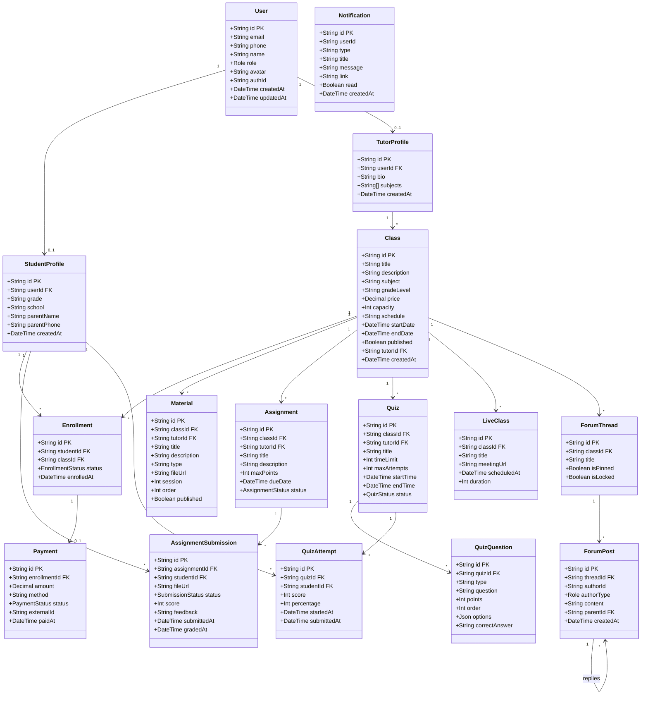

# UML Diagrams

## Platform E-Learning - Tutor Nomor Satu

---

## 1. Use Case Diagrams

### 1.1 Student Use Cases

```
                    Student Use Cases
┌─────────────────────────────────────────────────────────────┐
│                                                             │
│                           ┌──────────┐                      │
│     ┌─────────────────────│ Student  │───────────────┐     │
│     │                     └──────────┘               │     │
│     │                                                 │     │
│     │                                                 │     │
│     ▼                                                 ▼     │
│  (Register)                                     (Login)    │
│     │                                                 │     │
│     │                                                 │     │
│     ▼                                                 ▼     │
│  (Browse Classes) ──────────> (Search Classes)            │
│     │                              │                       │
│     │                              │                       │
│     ▼                              ▼                       │
│  (View Class Detail)          (Filter Classes)            │
│     │                                                       │
│     │                                                       │
│     ▼                                                       │
│  (Enroll in Class)                                         │
│     │                                                       │
│     │                                                       │
│     ▼                                                       │
│  (Make Payment) ──────────> (Apply Promo Code)            │
│     │                                                       │
│     │                                                       │
│     ▼                                                       │
│  (Access Class Materials)                                  │
│     │                                                       │
│     │                                                       │
│     ▼                                                       │
│  (View Video Lessons) ────> (Download Materials)          │
│     │                              │                       │
│     │                              │                       │
│     ▼                              ▼                       │
│  (Take Quiz)                  (Submit Assignment)         │
│     │                              │                       │
│     │                              │                       │
│     ▼                              ▼                       │
│  (Join Live Class)            (Participate in Forum)      │
│     │                              │                       │
│     │                              │                       │
│     ▼                              ▼                       │
│  (View Grades)                (Track Progress)            │
│     │                                                       │
│     │                                                       │
│     ▼                                                       │
│  (View Certificate)                                        │
│                                                             │
└─────────────────────────────────────────────────────────────┘
```

### 1.2 Tutor Use Cases

```
                   Tutor Use Cases
┌─────────────────────────────────────────────────────────────┐
│                                                             │
│                        ┌──────────────┐                     │
│     ┌──────────────────│    Tutor     │──────────────┐     │
│     │                  └──────────────┘              │     │
│     │                                                 │     │
│     │                                                 │     │
│     ▼                                                 ▼     │
│  (Register as Tutor)                           (Login)     │
│     │                                                       │
│     │                                                       │
│     ▼                                                       │
│  (Create Class) ──────────> (Set Class Info)              │
│     │                              │                       │
│     │                              │                       │
│     ▼                              ▼                       │
│  (Set Schedule)               (Set Pricing)               │
│     │                                                       │
│     │                                                       │
│     ▼                                                       │
│  (Upload Materials) ──────────> (Upload Videos)           │
│     │                              │                       │
│     │                              │                       │
│     ▼                              ▼                       │
│  (Create Quiz)                (Create Assignment)         │
│     │                              │                       │
│     │                              │                       │
│     ▼                              ▼                       │
│  (Publish Class)              (View Student List)         │
│     │                              │                       │
│     │                              │                       │
│     ▼                              ▼                       │
│  (Grade Assignments)          (Manage Forum)              │
│     │                              │                       │
│     │                              │                       │
│     ▼                              ▼                       │
│  (Conduct Live Class)         (View Analytics)            │
│     │                              │                       │
│     │                              │                       │
│     ▼                              ▼                       │
│  (View Earnings)              (Generate Reports)          │
│                                                             │
└─────────────────────────────────────────────────────────────┘
```

### 1.3 Admin Use Cases

```
                      Admin Use Cases
┌─────────────────────────────────────────────────────────────┐
│                                                             │
│                          ┌──────────┐                       │
│     ┌────────────────────│  Admin   │────────────────┐     │
│     │                    └──────────┘                │     │
│     │                                                 │     │
│     │                                                 │     │
│     ▼                                                 ▼     │
│  (Login)                                    (View Dashboard)│
│     │                                                 │     │
│     │                                                 │     │
│     ▼                                                 ▼     │
│  (Manage Users) ────────> (View User Details)             │
│     │                              │                       │
│     │                              │                       │
│     ▼                              ▼                       │
│  (Suspend/Delete Users)      (Change User Roles)          │
│     │                                                       │
│     │                                                       │
│     ▼                                                       │
│  (Manage Classes)                                          │
│     │                                                       │
│     │                                                       │
│     ▼                                                       │
│  (Approve/Reject Classes) ──> (View Class Details)        │
│     │                                                       │
│     │                                                       │
│     ▼                                                       │
│  (Feature Classes)                                         │
│     │                                                       │
│     │                                                       │
│     ▼                                                       │
│  (Moderate Content) ─────> (Review Reports)               │
│     │                              │                       │
│     │                              │                       │
│     ▼                              ▼                       │
│  (Delete Inappropriate Content)  (Warn Users)             │
│     │                                                       │
│     │                                                       │
│     ▼                                                       │
│  (Manage Categories)                                       │
│     │                                                       │
│     │                                                       │
│     ▼                                                       │
│  (View Analytics) ───────> (Generate Reports)             │
│     │                              │                       │
│     │                              │                       │
│     ▼                              ▼                       │
│  (Monitor Payments)           (View Transactions)         │
│     │                                                       │
│     │                                                       │
│     ▼                                                       │
│  (System Settings)                                         │
│                                                             │
└─────────────────────────────────────────────────────────────┘
```

---

## 2. Activity Diagrams

### 2.1 Student Registration Activity

```
                  Student Registration Flow
┌─────────────────────────────────────────────────────────┐
│                        START                            │
└───────────────────────────┬─────────────────────────────┘
                            │
                            ▼
                  ┌──────────────────┐
                  │ User clicks      │
                  │ "Register"       │
                  └────────┬─────────┘
                           │
                           ▼
                  ┌──────────────────┐
                  │ Fill registration│
                  │ form (email,     │
                  │ password, name)  │
                  └────────┬─────────┘
                           │
                           ▼
                  ┌──────────────────┐
                  │ Select role      │
                  │ (Student/Tutor)  │
                  └────────┬─────────┘
                           │
                           ▼
                  ┌──────────────────┐
                  │ Submit form      │
                  └────────┬─────────┘
                           │
                           ▼
                  ┌──────────────────┐
                  │ Validate input   │
                  └────────┬─────────┘
                           │
                    ┌──────┴──────┐
                    │             │
                Valid?         Invalid
                    │             │
                    │             ▼
                    │    ┌──────────────────┐
                    │    │ Show error       │
                    │    │ message          │
                    │    └────────┬─────────┘
                    │             │
                    │             └──────┐
                    │                    │
                    ▼                    │
          ┌──────────────────┐          │
          │ Check if email   │          │
          │ already exists   │          │
          └────────┬─────────┘          │
                   │                    │
            ┌──────┴──────┐            │
            │             │            │
         Exists?      Not exists       │
            │             │            │
            ▼             ▼            │
   ┌──────────────┐  ┌──────────────┐ │
   │ Show error   │  │ Create user  │ │
   │ "Email taken"│  │ in Supabase  │ │
   └──────┬───────┘  └──────┬───────┘ │
          │                 │         │
          └─────────┬───────┘         │
                    │                 │
                    ▼                 │
          ┌──────────────────┐        │
          │ Create profile   │        │
          │ (Student/Tutor)  │        │
          └────────┬─────────┘        │
                   │                  │
                   ▼                  │
          ┌──────────────────┐        │
          │ Send verification│        │
          │ email            │        │
          └────────┬─────────┘        │
                   │                  │
                   ▼                  │
          ┌──────────────────┐        │
          │ Show success     │        │
          │ message          │        │
          └────────┬─────────┘        │
                   │                  │
                   │◄─────────────────┘
                   │
                   ▼
          ┌──────────────────┐
          │       END         │
          └───────────────────┘
```

### 2.2 Class Enrollment & Payment Activity

```
              Class Enrollment & Payment Flow
┌────────────────────────────────────────────────────────┐
│                      START                             │
└──────────────────────┬─────────────────────────────────┘
                       │
                       ▼
              ┌─────────────────┐
              │ Browse classes   │
              └────────┬─────────┘
                       │
                       ▼
              ┌─────────────────┐
              │ Select class     │
              └────────┬─────────┘
                       │
                       ▼
              ┌─────────────────┐
              │ View class       │
              │ details          │
              └────────┬─────────┘
                       │
                ┌──────┴──────┐
                │             │
            Free class?   Paid class
                │             │
                │             ▼
                │    ┌─────────────────┐
                │    │ Click "Enroll"  │
                │    └────────┬─────────┘
                │             │
                │             ▼
                │    ┌─────────────────┐
                │    │ Check capacity  │
                │    └────────┬─────────┘
                │             │
                │      ┌──────┴──────┐
                │      │             │
                │   Full?         Available
                │      │             │
                │      ▼             │
                │ ┌─────────────┐   │
                │ │ Show error  │   │
                │ │ "Class Full"│   │
                │ └──────┬──────┘   │
                │        │          │
                │        └──────┐   │
                │               │   │
                │               │   ▼
                │               │ ┌─────────────────┐
                │               │ │ Create          │
                │               │ │ enrollment      │
                │               │ └────────┬─────────┘
                │               │          │
                │               │          ▼
                │               │ ┌─────────────────┐
                │               │ │ Create payment  │
                │               │ │ transaction     │
                │               │ └────────┬─────────┘
                │               │          │
                │               │          ▼
                │               │ ┌─────────────────┐
                │               │ │ Redirect to     │
                │               │ │ Pakasir payment │
                │               │ └────────┬─────────┘
                │               │          │
                │               │          ▼
                │               │ ┌─────────────────┐
                │               │ │ Complete payment│
                │               │ │ (QRIS/VA)       │
                │               │ └────────┬─────────┘
                │               │          │
                │               │    ┌─────┴──────┐
                │               │    │            │
                │               │ Success?    Failed
                │               │    │            │
                │               │    │            ▼
                │               │    │   ┌─────────────────┐
                │               │    │   │ Show error      │
                │               │    │   │ message         │
                │               │    │   └────────┬─────────┘
                │               │    │            │
                │               │    │            └──────┐
                │               │    │                   │
                ▼               ▼    ▼                   │
        ┌──────────────────────────────┐               │
        │ Update enrollment to PAID    │               │
        └────────┬─────────────────────┘               │
                 │                                      │
                 ▼                                      │
        ┌──────────────────┐                          │
        │ Grant access to  │                          │
        │ class materials  │                          │
        └────────┬──────────┘                          │
                 │                                      │
                 ▼                                      │
        ┌──────────────────┐                          │
        │ Send confirmation│                          │
        │ email            │                          │
        └────────┬──────────┘                          │
                 │                                      │
                 ▼                                      │
        ┌──────────────────┐                          │
        │ Redirect to      │                          │
        │ My Classes       │                          │
        └────────┬──────────┘                          │
                 │                                      │
                 │◄─────────────────────────────────────┘
                 │
                 ▼
        ┌──────────────────┐
        │       END         │
        └───────────────────┘
```

### 2.3 Class Creation Activity (Tutor)

```
                 Class Creation Flow
┌────────────────────────────────────────────────────────┐
│                      START                             │
└──────────────────────┬─────────────────────────────────┘
                       │
                       ▼
              ┌─────────────────┐
              │ Click "Create   │
              │ New Class"      │
              └────────┬─────────┘
                       │
                       ▼
              ┌─────────────────┐
              │ Enter class     │
              │ basic info      │
              │ (title, desc)   │
              └────────┬─────────┘
                       │
                       ▼
              ┌─────────────────┐
              │ Select subject  │
              │ & grade level   │
              └────────┬─────────┘
                       │
                       ▼
              ┌─────────────────┐
              │ Set pricing &   │
              │ capacity        │
              └────────┬─────────┘
                       │
                       ▼
              ┌─────────────────┐
              │ Set schedule    │
              │ (dates, time)   │
              └────────┬─────────┘
                       │
                       ▼
              ┌─────────────────┐
              │ Upload thumbnail│
              └────────┬─────────┘
                       │
                       ▼
              ┌─────────────────┐
              │ Save as draft   │
              └────────┬─────────┘
                       │
                       ▼
              ┌─────────────────┐
              │ Add materials   │
              └────────┬─────────┘
                       │
                       ▼
          ┌────────────┴────────────┐
          │                         │
    ┌─────▼──────┐          ┌──────▼──────┐
    │ Video      │          │ Document/   │
    │ lessons    │          │ PDF         │
    └─────┬──────┘          └──────┬──────┘
          │                        │
          ▼                        ▼
    ┌─────────────┐          ┌─────────────┐
    │ Upload video│          │ Upload file │
    │ to storage  │          │ to storage  │
    └─────┬───────┘          └──────┬──────┘
          │                         │
          └────────────┬────────────┘
                       │
                       ▼
              ┌─────────────────┐
              │ Create          │
              │ assignments     │
              └────────┬─────────┘
                       │
                       ▼
              ┌─────────────────┐
              │ Create quizzes  │
              └────────┬─────────┘
                       │
                       ▼
              ┌─────────────────┐
              │ Preview class   │
              └────────┬─────────┘
                       │
                       ▼
              ┌─────────────────┐
              │ All content     │
              │ complete?       │
              └────────┬─────────┘
                       │
                 ┌─────┴─────┐
                 │           │
               Yes           No
                 │           │
                 │           ▼
                 │  ┌─────────────────┐
                 │  │ Continue editing│
                 │  └────────┬─────────┘
                 │           │
                 │           └──────┐
                 │                  │
                 ▼                  │
        ┌─────────────────┐         │
        │ Publish class   │         │
        └────────┬─────────┘         │
                 │                   │
                 ▼                   │
        ┌─────────────────┐         │
        │ Class visible   │         │
        │ to students     │         │
        └────────┬─────────┘         │
                 │                   │
                 │◄──────────────────┘
                 │
                 ▼
        ┌─────────────────┐
        │       END       │
        └─────────────────┘
```

### 2.4 Assignment Submission & Grading Activity

```
           Assignment Submission & Grading Flow
┌────────────────────────────────────────────────────────┐
│                      START                             │
└──────────────────────┬─────────────────────────────────┘
                       │
                       ▼
              ┌─────────────────┐
              │ Tutor creates   │
              │ assignment      │
              └────────┬─────────┘
                       │
                       ▼
              ┌─────────────────┐
              │ Set title, desc,│
              │ due date, points│
              └────────┬─────────┘
                       │
                       ▼
              ┌─────────────────┐
              │ Publish         │
              │ assignment      │
              └────────┬─────────┘
                       │
                       ▼
              ┌─────────────────┐
              │ Students receive│
              │ notification    │
              └────────┬─────────┘
                       │
                       ▼
              ┌─────────────────┐
              │ Student views   │
              │ assignment      │
              └────────┬─────────┘
                       │
                       ▼
              ┌─────────────────┐
              │ Prepare solution│
              └────────┬─────────┘
                       │
                       ▼
              ┌─────────────────┐
              │ Upload file     │
              └────────┬─────────┘
                       │
                       ▼
              ┌─────────────────┐
              │ Submit          │
              └────────┬─────────┘
                       │
                ┌──────┴──────┐
                │             │
          Before deadline   After deadline
                │             │
                ▼             ▼
        ┌─────────────┐ ┌─────────────┐
        │ Status:     │ │ Status:     │
        │ SUBMITTED   │ │ LATE        │
        └──────┬──────┘ └──────┬──────┘
               │               │
               └───────┬───────┘
                       │
                       ▼
              ┌─────────────────┐
              │ Tutor receives  │
              │ notification    │
              └────────┬─────────┘
                       │
                       ▼
              ┌─────────────────┐
              │ Tutor reviews   │
              │ submission      │
              └────────┬─────────┘
                       │
                       ▼
              ┌─────────────────┐
              │ Enter score &   │
              │ feedback        │
              └────────┬─────────┘
                       │
                       ▼
              ┌─────────────────┐
              │ Submit grade    │
              └────────┬─────────┘
                       │
                       ▼
              ┌─────────────────┐
              │ Update gradebook│
              └────────┬─────────┘
                       │
                       ▼
              ┌─────────────────┐
              │ Student receives│
              │ notification    │
              └────────┬─────────┘
                       │
                       ▼
              ┌─────────────────┐
              │ Student views   │
              │ grade & feedback│
              └────────┬─────────┘
                       │
                       ▼
              ┌─────────────────┐
              │       END       │
              └─────────────────┘
```



---

## 3. Sequence Diagrams

### 3.1 User Authentication Sequence

```
 Student    Frontend      API        Supabase      Database
   │           │           │          Auth            │
   │           │           │           │              │
   │  Login    │           │           │              │
   │──────────>│           │           │              │
   │           │           │           │              │
   │           │ POST /api/auth/login  │              │
   │           │──────────>│           │              │
   │           │           │           │              │
   │           │           │ Validate  │              │
   │           │           │──────────>│              │
   │           │           │           │              │
   │           │           │           │ Query user   │
   │           │           │           │─────────────>│
   │           │           │           │              │
   │           │           │           │<─────────────│
   │           │           │           │  User data   │
   │           │           │           │              │
   │           │           │<──────────│              │
   │           │           │ JWT token │              │
   │           │           │ & session │              │
   │           │           │           │              │
   │           │<──────────│           │              │
   │           │ JWT +     │           │              │
   │           │ User data │           │              │
   │           │           │           │              │
   │<──────────│           │           │              │
   │ Redirect  │           │           │              │
   │ Dashboard │           │           │              │
   │           │           │           │              │
```

### 3.2 Student Enrollment & Payment Sequence

```
Student  Frontend   API   Pakasir   Database  Email
  │         │        │     Payment     │      Service
  │         │        │     Gateway     │        │
  │ Enroll  │        │        │        │        │
  │ class   │        │        │        │        │
  │────────>│        │        │        │        │
  │         │        │        │        │        │
  │         │ POST /api/enrollments   │        │
  │         │────────────────>│        │        │
  │         │        │        │        │        │
  │         │        │ Create │        │        │
  │         │        │ enrollment      │        │
  │         │        │────────────────>│        │
  │         │        │        │        │        │
  │         │        │ Create payment  │        │
  │         │        │────────────────>│        │
  │         │        │        │        │        │
  │         │        │ Create │        │        │
  │         │        │ transaction     │        │
  │         │        │───────>│        │        │
  │         │        │        │        │        │
  │         │        │<───────│        │        │
  │         │        │ Payment│        │        │
  │         │        │ URL    │        │        │
  │         │        │        │        │        │
  │         │<───────│        │        │        │
  │         │ Payment│        │        │        │
  │         │ URL    │        │        │        │
  │         │        │        │        │        │
  │ Redirect to payment page  │        │        │
  │──────────────────────────>│        │        │
  │         │        │        │        │        │
  │ Complete payment (QRIS/VA)│        │        │
  │<──────────────────────────│        │        │
  │         │        │        │        │        │
  │         │        │ Webhook│        │        │
  │         │        │<───────│        │        │
  │         │        │        │        │        │
  │         │        │ Verify │        │        │
  │         │        │ signature       │        │
  │         │        │        │        │        │
  │         │        │ Update │        │        │
  │         │        │ payment│        │        │
  │         │        │────────────────>│        │
  │         │        │        │        │        │
  │         │        │ Update │        │        │
  │         │        │ enrollment      │        │
  │         │        │────────────────>│        │
  │         │        │        │        │        │
  │         │        │ Send   │        │        │
  │         │        │ confirmation    │        │
  │         │        │────────────────────────>│
  │         │        │        │        │        │
  │         │        │ Return │        │        │
  │         │        │ 200 OK │        │        │
  │         │        │───────>│        │        │
  │         │        │        │        │        │
  │<────────────────────────────        │        │
  │ Redirect to My Classes              │        │
  │         │        │        │        │        │
```

### 3.3 Assignment Submission Sequence

```
Student Frontend  API   Database  Storage   Tutor
  │        │       │        │         │       │
  │        │       │        │         │       │
  │ Upload │       │        │         │       │
  │ file   │       │        │         │       │
  │───────>│       │        │         │       │
  │        │       │        │         │       │
  │        │ Upload to storage        │       │
  │        │──────────────────────────>       │
  │        │       │        │         │       │
  │        │<──────────────────────────│       │
  │        │ File  │        │   URL   │       │
  │        │ URL   │        │         │       │
  │        │       │        │         │       │
  │        │ POST /api/assignments/:id/submit │
  │        │──────>│        │         │       │
  │        │       │        │         │       │
  │        │       │ Create │         │       │
  │        │       │ submission       │       │
  │        │       │───────>│         │       │
  │        │       │        │         │       │
  │        │       │ Create │         │       │
  │        │       │ notification     │       │
  │        │       │───────>│         │       │
  │        │       │        │         │       │
  │        │       │ Notify │         │       │
  │        │       │ tutor  │         │       │
  │        │       │────────────────────────>│
  │        │       │        │         │       │
  │        │<──────│        │         │       │
  │        │Success│        │         │       │
  │        │       │        │         │       │
  │<───────│       │        │         │       │
  │ Show   │       │        │         │       │
  │ success│       │        │         │       │
  │        │       │        │         │       │
```

### 3.4 Quiz Taking Sequence

```
Student  Frontend   API   Database
  │         │        │        │
  │         │        │        │
  │ Start   │        │        │
  │ Quiz    │        │        │
  │────────>│        │        │
  │         │        │        │
  │         │ POST /api/quizzes/:id/start
  │         │────────────────>│
  │         │        │        │
  │         │        │ Create │
  │         │        │ attempt│
  │         │        │───────>│
  │         │        │        │
  │         │        │ Fetch  │
  │         │        │ questions
  │         │        │───────>│
  │         │        │        │
  │         │        │<───────│
  │         │        │ Questions
  │         │        │ (no answers)
  │         │        │        │
  │         │<───────│        │
  │         │ Questions        │
  │         │ & attemptId      │
  │         │        │        │
  │<────────│        │        │
  │ Display │        │        │
  │ quiz    │        │        │
  │         │        │        │
  │ Answer  │        │        │
  │ questions        │        │
  │         │        │        │
  │ (auto-save every 5 seconds)│
  │────────>│        │        │
  │         │ PUT /api/quiz-attempts/:id/autosave
  │         │────────────────>│
  │         │        │ Save   │
  │         │        │ answers│
  │         │        │───────>│
  │         │        │        │
  │         │        │        │
  │ Submit  │        │        │
  │ Quiz    │        │        │
  │────────>│        │        │
  │         │        │        │
  │         │ POST /api/quizzes/:id/submit
  │         │────────────────>│
  │         │        │        │
  │         │        │ Fetch  │
  │         │        │ correct│
  │         │        │ answers│
  │         │        │───────>│
  │         │        │        │
  │         │        │ Auto-  │
  │         │        │ grade  │
  │         │        │        │
  │         │        │ Update │
  │         │        │ attempt│
  │         │        │───────>│
  │         │        │        │
  │         │<───────│        │
  │         │ Results│        │
  │         │        │        │
  │<────────│        │        │
  │ Show    │        │        │
  │ score & │        │        │
  │ review  │        │        │
  │         │        │        │
```

---

## 4. Class Diagram

```
┌─────────────────────────────────────────────────────────────┐
│                         User                                │
├─────────────────────────────────────────────────────────────┤
│ - id: string                                                │
│ - email: string                                             │
│ - phone: string                                             │
│ - name: string                                              │
│ - avatar: string?                                           │
│ - role: UserRole (STUDENT/TUTOR/ADMIN)                      │
│ - authId: string                                            │
│ - createdAt: Date                                           │
│ - updatedAt: Date                                           │
├─────────────────────────────────────────────────────────────┤
│ + register(): Promise<User>                                 │
│ + login(credentials): Promise<AuthResponse>                 │
│ + updateProfile(data): Promise<User>                        │
│ + changePassword(oldPwd, newPwd): Promise<void>            │
└──────────────────┬──────────────────────────────────────────┘
                   │
       ┌───────────┴───────────┐
       │                       │
       ▼                       ▼
┌──────────────────┐ ┌──────────────────┐
│ StudentProfile   │ │  TutorProfile    │
├──────────────────┤ ├──────────────────┤
│ - id: string     │ │ - id: string     │
│ - userId: string │ │ - userId: string │
│ - grade: string  │ │ - bio: text      │
│ - school: string │ │ - subjects: []   │
│ - parentName     │ │ - createdAt      │
│ - parentPhone    │ │                  │
│ - createdAt      │ │                  │
├──────────────────┤ ├──────────────────┤
│+ enroll()        │ │+ createClass()   │
│+ submitAssign()  │ │+ gradeAssign()   │
│+ takeQuiz()      │ │+ createQuiz()    │
└──────┬───────────┘ └──────┬───────────┘
       │                    │
       │                    ▼
       │      ┌──────────────────────┐
       │      │       Class          │
       │      ├──────────────────────┤
       │      │ - id: string         │
       │      │ - title: string      │
       │      │ - description: string│
       │      │ - subject: string    │
       │      │ - gradeLevel: string │
       │      │ - price: decimal     │
       │      │ - capacity: int      │
       │      │ - schedule: string   │
       │      │ - startDate: Date    │
       │      │ - endDate: Date      │
       │      │ - published: boolean │
       │      │ - tutorId: string    │
       │      ├──────────────────────┤
       │      │ + publish(): void    │
       │      │ + addMaterial(): void│
       │      │ + enroll(userId): void│
       │      └──────────┬───────────┘
       │                 │
       │                 │
       │      ┌──────────┼──────────────────────┐
       │      │          │                      │
       │      ▼          ▼                      ▼
       │  ┌──────────┐ ┌──────────┐      ┌──────────────┐
       │  │ Material │ │Assignment│      │   Quiz       │
       │  ├──────────┤ ├──────────┤      ├──────────────┤
       │  │ - id     │ │ - id     │      │ - id         │
       │  │ - title  │ │ - title  │      │ - title      │
       │  │ - type   │ │ - desc   │      │ - timeLimit  │
       │  │ - fileUrl│ │ - dueDate│      │ - maxAttempts│
       │  │ - session│ │ - maxPts │      │ - startTime  │
       │  ├──────────┤ ├──────────┤      ├──────────────┤
       │  │+ view()  │ │+ submit()│      │+ take()      │
       │  └──────────┘ └─────┬────┘      └──────┬───────┘
       │                     │                   │
       │                     ▼                   ▼
       │            ┌─────────────────┐  ┌──────────────┐
       │            │Assignment       │  │QuizQuestion  │
       │            │Submission       │  ├──────────────┤
       │            ├─────────────────┤  │ - id         │
       │            │ - id            │  │ - question   │
       │            │ - studentId     │  │ - type       │
       │            │ - assignmentId  │  │ - options    │
       │            │ - fileUrl       │  │ - correctAns │
       │            │ - status        │  │ - points     │
       │            │ - score         │  └──────────────┘
       │            │ - feedback      │          │
       │            │ - submittedAt   │          │
       │            │ - gradedAt      │          ▼
       │            ├─────────────────┤  ┌──────────────┐
       │            │+ grade()        │  │QuizAttempt   │
       │            └─────────────────┘  ├──────────────┤
       │                                 │ - id         │
       │                                 │ - studentId  │
       │                                 │ - quizId     │
       │                                 │ - score      │
       │                                 │ - percentage │
       │                                 │ - startedAt  │
       │                                 │ - submittedAt│
       │                                 ├──────────────┤
       │                                 │+ calculate() │
       │                                 └──────────────┘
       │
       ▼
┌──────────────────┐
│   Enrollment     │
├──────────────────┤
│ - id: string     │
│ - studentId      │
│ - classId        │
│ - status: enum   │
│ - enrolledAt     │
├──────────────────┤
│ + trackProgress()│
│ + complete()     │
└──────────┬───────┘
           │
           ▼
    ┌──────────────┐
    │   Payment    │
    ├──────────────┤
    │ - id         │
    │ - enrollId   │
    │ - amount     │
    │ - method     │
    │ - status     │
    │ - externalId │
    │ - paidAt     │
    ├──────────────┤
    │ + process()  │
    │ + verify()   │
    └──────────────┘

┌──────────────────┐
│   LiveClass      │
├──────────────────┤
│ - id: string     │
│ - classId        │
│ - title          │
│ - meetingUrl     │
│ - scheduledAt    │
│ - duration       │
├──────────────────┤
│ + start()        │
│ + end()          │
└──────────────────┘

┌──────────────────┐
│  ForumThread     │
├──────────────────┤
│ - id: string     │
│ - classId        │
│ - title          │
│ - isPinned       │
│ - isLocked       │
├──────────────────┤
│ + pin()          │
│ + lock()         │
└────────┬─────────┘
         │
         ▼
┌──────────────────┐
│    ForumPost     │
├──────────────────┤
│ - id: string     │
│ - threadId       │
│ - authorId       │
│ - authorType     │
│ - content        │
│ - parentId?      │
│ - createdAt      │
├──────────────────┤
│ + reply()        │
│ + edit()         │
└──────────────────┘

┌──────────────────┐
│  Notification    │
├──────────────────┤
│ - id: string     │
│ - userId         │
│ - type           │
│ - title          │
│ - message        │
│ - link           │
│ - read: boolean  │
│ - createdAt      │
├──────────────────┤
│ + markAsRead()   │
│ + send()         │
└──────────────────┘
```

---

## 5. State Diagrams

### 5.1 Enrollment Status State Diagram

```
              Enrollment Lifecycle States

         ┌─────────────────┐
         │                 │
         │    PENDING      │
         │                 │
         └────────┬────────┘
                  │
                  │ Payment
                  │ Success
                  │
                  ▼
         ┌─────────────────┐
         │                 │
         │      PAID       │
         │                 │
         └────────┬────────┘
                  │
                  │ Class
                  │ Starts
                  │
                  ▼
         ┌─────────────────┐
         │                 │
         │     ACTIVE      │◄──────────┐
         │                 │           │
         └────────┬────────┘           │
                  │                    │
           ┌──────┴──────┐            │
           │             │            │
      Class ends    Student withdraws │
           │             │            │
           ▼             ▼            │
  ┌─────────────┐ ┌─────────────┐    │
  │             │ │             │    │
  │  COMPLETED  │ │  CANCELLED  │────┘
  │             │ │             │
  └─────────────┘ └─────────────┘
```

### 5.2 Assignment Submission Status State Diagram

```
          Assignment Submission States

         ┌─────────────────┐
         │                 │
         │ NOT_SUBMITTED   │
         │                 │
         └────────┬────────┘
                  │
           ┌──────┴──────┐
           │             │
      Before due    After due
           │             │
           ▼             ▼
  ┌─────────────┐ ┌─────────────┐
  │             │ │             │
  │  SUBMITTED  │ │    LATE     │
  │             │ │             │
  └──────┬──────┘ └──────┬──────┘
         │               │
         │               ▼
         │        ┌─────────────┐
         │        │  SUBMITTED  │
         │        │  (Late)     │
         │        └──────┬──────┘
         │               │
         └───────┬───────┘
                 │
                 │ Tutor
                 │ Grades
                 │
                 ▼
         ┌─────────────────┐
         │                 │
         │     GRADED      │
         │                 │
         └─────────────────┘
```

### 5.3 Payment Status State Diagram

```
            Payment Transaction States

         ┌─────────────────┐
         │                 │
         │    PENDING      │
         │                 │
         └────────┬────────┘
                  │
         ┌────────┴────────┐
         │                 │
    Webhook           Timeout/
    Success            Error
         │                 │
         ▼                 ▼
┌─────────────────┐ ┌─────────────────┐
│                 │ │                 │
│     PAID        │ │     FAILED      │
│                 │ │                 │
└────────┬────────┘ └─────────────────┘
         │
         │ Refund
         │ Request
         │
         ▼
┌─────────────────┐
│                 │
│    REFUNDED     │
│                 │
└─────────────────┘
```

### 5.4 Quiz Status State Diagram

```
                  Quiz States

         ┌─────────────────┐
         │                 │
         │     DRAFT       │
         │                 │
         └────────┬────────┘
                  │
                  │ Tutor
                  │ Publishes
                  │
                  ▼
         ┌─────────────────┐
         │                 │
         │   PUBLISHED     │
         │                 │
         └────────┬────────┘
                  │
                  │ End time
                  │ Reached
                  │
                  ▼
         ┌─────────────────┐
         │                 │
         │     CLOSED      │
         │                 │
         └─────────────────┘
```

---

## 6. Component Diagram

```
┌──────────────────────────────────────────────────────────────┐
│                    Frontend Layer                            │
│                  (Next.js 15 with App Router)                │
│                                                              │
│  ┌────────────┐  ┌────────────┐  ┌────────────────────┐    │
│  │   Pages    │  │Components  │  │   Client State     │    │
│  │  (Routes)  │  │  (UI/UX)   │  │   (React Hooks)    │    │
│  └─────┬──────┘  └─────┬──────┘  └──────────┬─────────┘    │
│        │               │                     │              │
│        └───────────────┴─────────────────────┘              │
│                        │                                    │
│                        ▼                                    │
│              ┌──────────────────┐                          │
│              │   API Client     │                          │
│              │  (Server Actions │                          │
│              │   & API Routes)  │                          │
│              └──────────┬───────┘                          │
└─────────────────────────┼──────────────────────────────────┘
                          │
                          │ HTTP/HTTPS
                          │
┌─────────────────────────▼──────────────────────────────────┐
│                    Backend Layer                           │
│               (Next.js API Routes & Actions)               │
│                                                            │
│  ┌────────────┐  ┌────────────┐  ┌──────────────────┐    │
│  │   API      │  │ Middleware │  │   Server Actions │    │
│  │  Routes    │  │   (Auth,   │  │  (Business Logic)│    │
│  │            │  │ Validation)│  │                  │    │
│  └─────┬──────┘  └─────┬──────┘  └──────────┬───────┘    │
│        │               │                     │            │
│        └───────────────┴─────────────────────┘            │
│                        │                                  │
│                        ▼                                  │
│              ┌──────────────────┐                        │
│              │  Prisma Client   │                        │
│              │  (ORM & Type-    │                        │
│              │   safe queries)  │                        │
│              └──────────┬───────┘                        │
└─────────────────────────┼────────────────────────────────┘
                          │
                          │ Database Queries
                          │
┌─────────────────────────▼──────────────────────────────────┐
│                    Data Layer                              │
│                                                            │
│  ┌────────────┐  ┌────────────┐  ┌──────────────────┐    │
│  │ PostgreSQL │  │  Supabase  │  │   File Storage   │    │
│  │  (Primary  │  │    Auth    │  │   (Supabase      │    │
│  │  Database) │  │  (JWT)     │  │    Storage)      │    │
│  └────────────┘  └────────────┘  └──────────────────┘    │
└────────────────────────────────────────────────────────────┘

┌──────────────────────────────────────────────────────────┐
│              External Services Layer                     │
│                                                          │
│  ┌────────────┐  ┌────────────┐  ┌──────────────────┐  │
│  │  Pakasir   │  │   Email    │  │   Meeting API    │  │
│  │  Payment   │  │  Service   │  │  (Future: Zoom,  │  │
│  │  Gateway   │  │  (SMTP)    │  │   Google Meet)   │  │
│  └────────────┘  └────────────┘  └──────────────────┘  │
└──────────────────────────────────────────────────────────┘
```

---

## 7. Deployment Diagram

```
┌──────────────────────────────────────────────────────────────┐
│                    Client Devices                            │
│                                                              │
│  ┌────────────┐  ┌────────────┐  ┌────────────────────┐    │
│  │  Desktop   │  │   Mobile   │  │     Tablet         │    │
│  │  Browser   │  │  Browser   │  │     Browser        │    │
│  └─────┬──────┘  └─────┬──────┘  └──────────┬─────────┘    │
│        │               │                     │              │
│        └───────────────┴─────────────────────┘              │
│                        │                                    │
└────────────────────────┼──────────────────────────────────┘
                         │
                         │ HTTPS
                         │
┌────────────────────────▼──────────────────────────────────┐
│              Vercel Edge Network (CDN)                    │
│                                                           │
│  ┌────────────────────────────────────────────────────┐  │
│  │   Static Assets (CSS, JS, Images)                  │  │
│  │   Edge Functions (Middleware)                      │  │
│  └────────────────────┬───────────────────────────────┘  │
└────────────────────────┼─────────────────────────────────┘
                         │
                         ▼
┌──────────────────────────────────────────────────────────┐
│            Vercel Serverless Functions                   │
│                                                          │
│  ┌────────────────────────────────────────────────────┐ │
│  │   Next.js Application                              │ │
│  │   - App Router                                     │ │
│  │   - API Routes                                     │ │
│  │   - Server Actions                                 │ │
│  │   - Server Components                              │ │
│  └────────────────────┬───────────────────────────────┘ │
└────────────────────────┼─────────────────────────────────┘
                         │
         ┌───────────────┼───────────────┐
         │               │               │
         ▼               ▼               ▼
┌─────────────────┐ ┌─────────────┐ ┌─────────────────┐
│  Supabase Cloud │ │  Pakasir    │ │  Email Service  │
│                 │ │  Payment    │ │  (SMTP)         │
│  ┌───────────┐  │ │  Gateway    │ └─────────────────┘
│  │PostgreSQL │  │ └─────────────┘
│  │ Database  │  │
│  └───────────┘  │
│                 │
│  ┌───────────┐  │
│  │ Supabase  │  │
│  │   Auth    │  │
│  │  (JWT)    │  │
│  └───────────┘  │
│                 │
│  ┌───────────┐  │
│  │ Supabase  │  │
│  │  Storage  │  │
│  │ (S3-like) │  │
│  └───────────┘  │
│                 │
│  ┌───────────┐  │
│  │ Realtime  │  │
│  │(WebSocket)│  │
│  └───────────┘  │
└─────────────────┘
```

---

## 8. Entity Relationship Diagram (ERD)

```
┌─────────────────────────────────────────────────────────────┐
│                   Database Schema Overview                  │
└─────────────────────────────────────────────────────────────┘

        USER (1)
          │
          ├──────────────┬──────────────┐
          │              │              │
          │ (1)          │ (1)          │ (1)
          │              │              │
          ▼              ▼              ▼
    STUDENT_PROFILE  TUTOR_PROFILE   (ADMIN)
          │              │
          │ (M)          │ (M)
          │              │
          │              └─────────────┐
          │                            │
          │                            ▼
          │                          CLASS (1)
          │                            │
          │                            ├────────┬────────┬─────────┐
          │                            │        │        │         │
          │                            │ (M)    │ (M)    │ (M)     │ (M)
          │                            │        │        │         │
          │                            ▼        ▼        ▼         ▼
          │                        MATERIAL ASSIGNMENT QUIZ  LIVE_CLASS
          │                                     │        │
          │                                     │ (M)    │ (M)
          │                                     │        │
          │                                     ▼        ▼
          │                            ASSIGNMENT_  QUIZ_QUESTION
          │                            SUBMISSION        │
          │                                 │            │ (M)
          │                                 │            │
          │                                 │            ▼
          │                                 │      QUIZ_ATTEMPT
          │                                 │            │
          │ (M)                             │            │ (M)
          │                                 │            │
          ├─────────────────────────────────┴────────────┤
          │                                              │
          │                                              │
          ▼                                              ▼
    ENROLLMENT (1)                              (Many references)
          │
          │ (1)
          │
          ▼
       PAYMENT


        CLASS (1)
          │
          │ (M)
          │
          ▼
    FORUM_THREAD (1)
          │
          │ (M)
          │
          ▼
      FORUM_POST
          │
          │ (M - self-referencing)
          │
          └─────> FORUM_POST (replies)


        USER (1)
          │
          │ (M)
          │
          ▼
    NOTIFICATION


┌─────────────────────────────────────────────────────────────┐
│                 Relationship Details                        │
├─────────────────────────────────────────────────────────────┤
│                                                             │
│  USER (1) ──────────────> (0..1) STUDENT_PROFILE           │
│  USER (1) ──────────────> (0..1) TUTOR_PROFILE             │
│                                                             │
│  TUTOR_PROFILE (1) ─────> (M) CLASS                        │
│                                                             │
│  STUDENT_PROFILE (1) ───> (M) ENROLLMENT                   │
│  CLASS (1) ──────────────> (M) ENROLLMENT                  │
│                                                             │
│  ENROLLMENT (1) ─────────> (0..1) PAYMENT                  │
│                                                             │
│  CLASS (1) ──────────────> (M) MATERIAL                    │
│  CLASS (1) ──────────────> (M) ASSIGNMENT                  │
│  CLASS (1) ──────────────> (M) QUIZ                        │
│  CLASS (1) ──────────────> (M) LIVE_CLASS                  │
│  CLASS (1) ──────────────> (M) FORUM_THREAD                │
│                                                             │
│  ASSIGNMENT (1) ─────────> (M) ASSIGNMENT_SUBMISSION       │
│  STUDENT_PROFILE (1) ────> (M) ASSIGNMENT_SUBMISSION       │
│                                                             │
│  QUIZ (1) ───────────────> (M) QUIZ_QUESTION               │
│  QUIZ (1) ───────────────> (M) QUIZ_ATTEMPT                │
│  STUDENT_PROFILE (1) ────> (M) QUIZ_ATTEMPT                │
│                                                             │
│  QUIZ_ATTEMPT (1) ───────> (M) QUIZ_ANSWER                 │
│  QUIZ_QUESTION (1) ──────> (M) QUIZ_ANSWER                 │
│                                                             │
│  FORUM_THREAD (1) ───────> (M) FORUM_POST                  │
│  FORUM_POST (1) ─────────> (M) FORUM_POST (replies)        │
│                                                             │
│  USER (1) ───────────────> (M) NOTIFICATION                │
│                                                             │
└─────────────────────────────────────────────────────────────┘

Legend:
  (1)  = One
  (M)  = Many
  (0..1) = Zero or One
  ──> = Relationship direction
```

---

**Document Version**: 1.0  
**Last Updated**: November 15, 2025  
**Owner**: PT. Tutor Nomor Satu - Development Team  
**Status**: Approved
