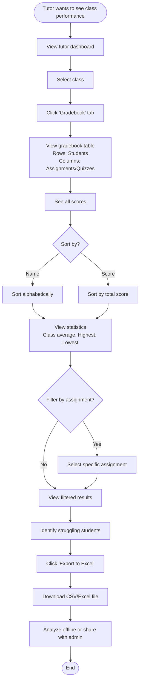

# User Flow Diagrams

# Platform E-Learning Tutor Nomor Satu

**Version:** 1.0  
**Last Updated:** November 15, 2025

---

## 1. Student User Flows

### 1.1 Student Registration & First Enrollment

### 1.2 Student Accessing Materials

### 1.3 Student Submitting Assignment

### 1.4 Student Taking Quiz

### 1.5 Student Joining Live Class

### 1.6 Student Viewing Grades

---

## 2. Tutor User Flows

### 2.1 Tutor Uploading Materials

### 2.2 Tutor Creating Assignment

### 2.3 Tutor Grading Assignments

### 2.4 Tutor Creating Quiz

### 2.5 Tutor Scheduling Live Class

### 2.6 Tutor Viewing Class Gradebook

---

## 3. Admin User Flows

### 3.1 Admin Creating Class

### 3.2 Admin Managing Users

### 3.3 Admin Monitoring Payments

### 3.4 Admin Viewing Analytics Dashboard

---

## 4. Common User Flows (All Roles)

### 4.1 Login Flow

### 4.2 Notification Flow

---

## 5. Error & Edge Case Flows

### 5.1 Payment Failed Flow

### 5.2 File Upload Failed Flow

---

**Document End**

> **Note**: These user flows represent the ideal paths and common edge cases. All flows are designed to be user-friendly with clear error messages and recovery options.
