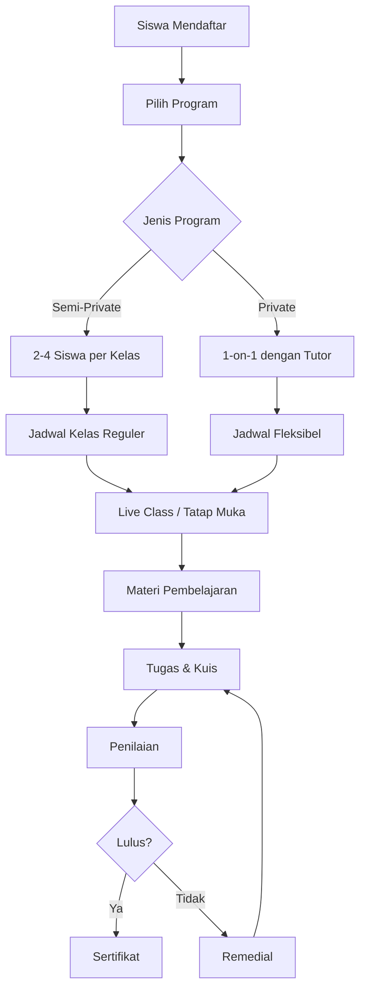

# Dokumentasi Program Pembelajaran - Tutor Nomor Satu

## Ringkasan Struktur Program

Platform pembelajaran Tutor Nomor Satu menawarkan berbagai program kelas yang dikategorikan berdasarkan jenis program dan target usia peserta.

---

## Kategori Program

### 1. Program Anak (`program-anak/`)

Program khusus untuk peserta usia anak-anak (SD-SMP).

| Kelas                            | File Gambar                         | Target    | Deskripsi                                 |
| -------------------------------- | ----------------------------------- | --------- | ----------------------------------------- |
| **Bahasa Inggris Anak**          | `Bahasa-Inggris-Anak.webp`          | Anak-anak | Kelas bahasa Inggris dasar untuk anak     |
| **Semi-Private Matematika Anak** | `Semi-Private-Matematika-Anak.webp` | Anak-anak | Kelas matematika semi-private (2-4 siswa) |

---

### 2. Program Dewasa (`program-dewasa/`)

Program intensif untuk peserta dewasa dengan fokus kemampuan Bahasa Inggris.

| Kelas                     | File Gambar                  | Target | Deskripsi                 |
| ------------------------- | ---------------------------- | ------ | ------------------------- |
| **Semi-Private Grammar**  | `Semi-Private Grammar.webp`  | Dewasa | Fokus tata bahasa Inggris |
| **Semi-Private IELTS**    | `Semi-Private-IELTS.webp`    | Dewasa | Persiapan tes IELTS       |
| **Semi-Private Speaking** | `Semi-Private-Speaking.webp` | Dewasa | Fokus kemampuan berbicara |
| **Semi-Private TOEFL**    | `Semi-Private-TOEFL.webp`    | Dewasa | Persiapan tes TOEFL       |

---

### 3. Regular/Private Dewasa (`regular-dewasa/`)

Program private 1-on-1 untuk berbagai usia.

| Kelas                             | File Gambar                          | Target    | Deskripsi                        |
| --------------------------------- | ------------------------------------ | --------- | -------------------------------- |
| **Private Bahasa Inggris Anak**   | `Private-Bahasa-Inggris-Anak.webp`   | Anak-anak | Les privat bahasa Inggris 1-on-1 |
| **Private Bahasa Inggris Dewasa** | `Private-Bahasa-Inggris-Dewasa.webp` | Dewasa    | Les privat bahasa Inggris 1-on-1 |
| **Private Matematika Anak**       | `Private-Matematika-Anak.webp`       | Anak-anak | Les privat matematika 1-on-1     |
| **Private Matematika Dewasa**     | `Private-Matematika-Dewasa.webp`     | Dewasa    | Les privat matematika 1-on-1     |

---

## Alur Pembelajaran



---

## Alur Sistem

### Untuk Siswa

1. **Registrasi** → Buat akun di platform
2. **Pilih Kelas** → Browse dan enroll ke kelas yang diinginkan
3. **Pembelajaran** → Akses materi, ikuti live class
4. **Evaluasi** → Kerjakan tugas dan kuis
5. **Nilai** → Lihat progress dan rapor

### Untuk Tutor

1. **Buat Kelas** → Admin assign tutor ke kelas
2. **Upload Materi** → Video, PDF, dokumen
3. **Jadwal Live Class** → Sesi pembelajaran langsung
4. **Penilaian** → Nilai tugas dan kuis siswa
5. **Monitoring** → Pantau progress siswa

### Untuk Admin

1. **Kelola Kelas** → CRUD operasi untuk semua kelas
2. **Kelola Tutor** → Assign tutor ke kelas
3. **Kelola Siswa** → Monitor enrollment
4. **Laporan** → Analytics dan statistik

---

## Struktur Folder Gambar

```
public/images/classes-list/
├── program-anak/
│   ├── Bahasa-Inggris-Anak.webp
│   └── Semi-Private-Matematika-Anak.webp
├── program-dewasa/
│   ├── Semi-Private Grammar.webp
│   ├── Semi-Private-IELTS.webp
│   ├── Semi-Private-Speaking.webp
│   └── Semi-Private-TOEFL.webp
└── regular-dewasa/
    ├── Private-Bahasa-Inggris-Anak.webp
    ├── Private-Bahasa-Inggris-Dewasa.webp
    ├── Private-Matematika-Anak.webp
    └── Private-Matematika-Dewasa.webp
```

---

## Penggunaan Gambar

Gambar-gambar ini digunakan sebagai **thumbnail** untuk kelas di:

- Halaman daftar kelas (`/student/classes`)
- Halaman admin classes (`/admin/classes`)
- Dashboard siswa dan tutor

### Contoh Penggunaan di Code

```tsx
// Di ClassCard component

```

---

## Format & Spesifikasi Gambar

| Property | Value                         |
| -------- | ----------------------------- |
| Format   | WebP                          |
| Ukuran   | ~60-100 KB per gambar         |
| Dimensi  | Rekomendasi 800x600 atau 16:9 |
| Kompresi | Lossy dengan kualitas tinggi  |

---

## Catatan Pengembangan

- Semua gambar menggunakan format **WebP** untuk performa optimal
- Penamaan file menggunakan format `Jenis-Program-Nama-Kelas.webp`
- Folder dikategorikan berdasarkan jenis program untuk kemudahan manajemen
