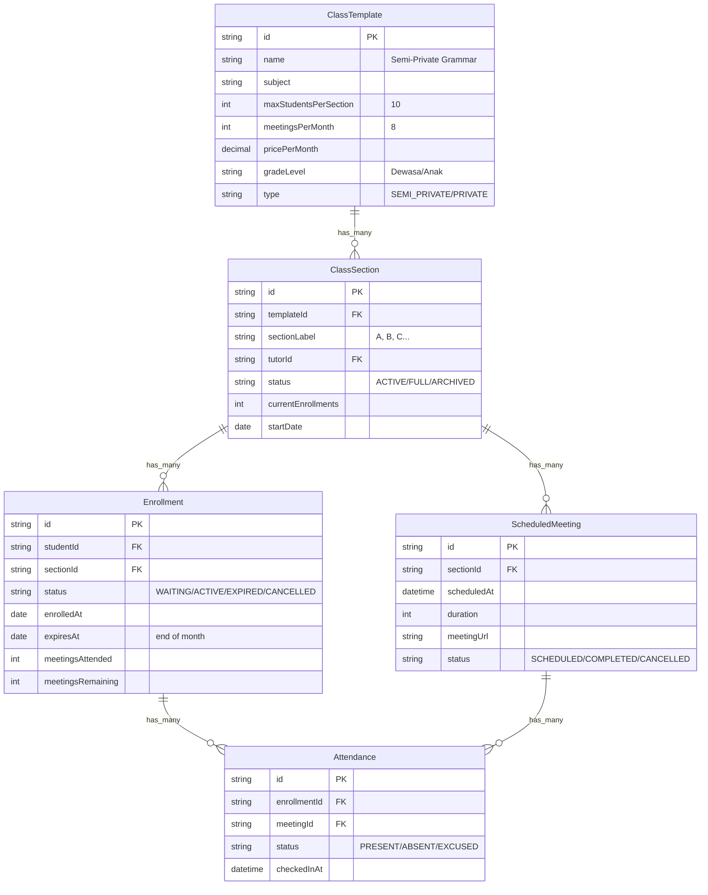
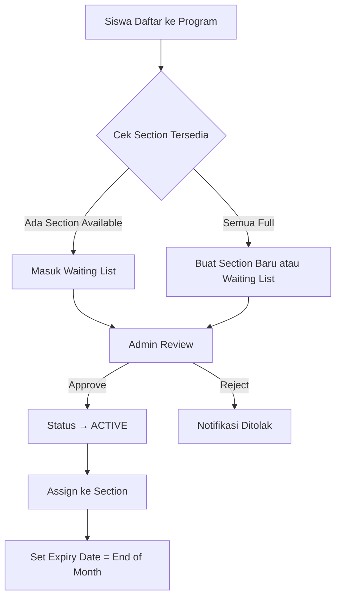
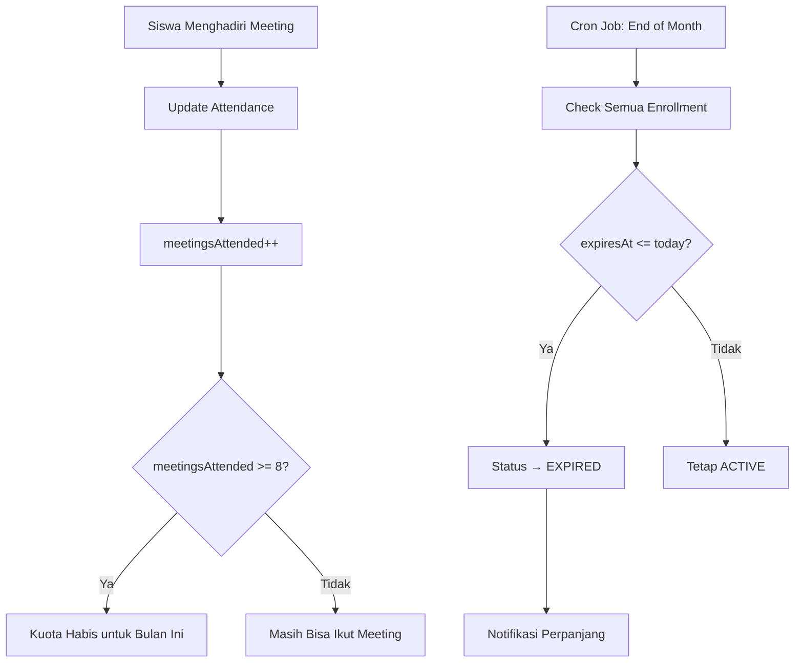
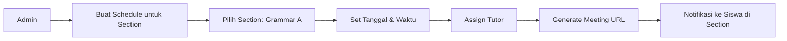

# Sistem Manajemen Kelas - Design Document

## Ringkasan Kebutuhan

Berdasarkan diskusi, berikut adalah kebutuhan utama sistem:

1. **Auto-scaling Class Sections** - Buat section baru (A, B, C...) saat kelas penuh
2. **Meeting Tracking** - Track 8x pertemuan per bulan per siswa
3. **Waiting List** - Siswa masuk waiting list sebelum di-approve admin
4. **Admin-Managed Scheduling** - Admin mengelola jadwal live class
5. **Subscription Period** - Periode berlangganan per bulan

---

## Pendekatan yang Direkomendasikan

### Opsi A: Class Section System (Direkomendasikan ✅)

```
Program Template → Class Section → Enrollment → Attendance
```

### Struktur Database



---

## Alur Sistem Detail

### 1. Pendaftaran Siswa (Registration Flow)



### 2. Auto Section Creation

```typescript
// Logic untuk auto-create section baru
async function enrollStudent(studentId: string, templateId: string) {
  // 1. Cari section yang masih available
  const availableSection = await db.classSection.findFirst({
    where: {
      templateId,
      status: "ACTIVE",
      currentEnrollments: { lt: template.maxStudentsPerSection },
    },
    orderBy: { sectionLabel: "asc" }, // Isi A dulu baru B, C...
  });

  if (availableSection) {
    // 2. Enroll ke section yang ada
    return createEnrollment(studentId, availableSection.id);
  }

  // 3. Buat section baru jika semua full
  const lastSection = await db.classSection.findFirst({
    where: { templateId },
    orderBy: { sectionLabel: "desc" },
  });

  const nextLabel = getNextLabel(lastSection?.sectionLabel || "@"); // A, B, C...

  const newSection = await db.classSection.create({
    data: {
      templateId,
      sectionLabel: nextLabel,
      status: "ACTIVE",
      currentEnrollments: 0,
    },
  });

  return createEnrollment(studentId, newSection.id);
}

function getNextLabel(current: string): string {
  // '@' -> 'A', 'A' -> 'B', ..., 'Z' -> 'AA'
  if (current === "@") return "A";
  const lastChar = current.slice(-1);
  if (lastChar === "Z") {
    return current.slice(0, -1) + "AA";
  }
  return current.slice(0, -1) + String.fromCharCode(lastChar.charCodeAt(0) + 1);
}
```

### 3. Meeting Tracking & Subscription Expiry



### 4. Admin-Managed Scheduling



---

## Status Flow

### Enrollment Status

| Status      | Deskripsi                       |
| ----------- | ------------------------------- |
| `WAITING`   | Menunggu approval admin         |
| `ACTIVE`    | Aktif, bisa ikut kelas          |
| `EXPIRED`   | Periode habis, perlu perpanjang |
| `CANCELLED` | Dibatalkan                      |
| `SUSPENDED` | Ditangguhkan sementara          |

### Aksi Berdasarkan Status

| Kondisi                 | Aksi                                   |
| ----------------------- | -------------------------------------- |
| 8x meeting tercapai     | Tidak bisa ikut meeting lagi bulan ini |
| Tanggal expiry tercapai | Status → EXPIRED, perlu bayar lagi     |
| Admin approve waiting   | Status → ACTIVE                        |

---

## Best Practices

### 1. Gunakan Subscription Period, Bukan Non-aktifkan Akun

```
❌ Non-aktifkan akun siswa setelah 8x meeting
✅ Enrollment status EXPIRED, akun tetap aktif
```

**Alasan:**

- Siswa masih bisa lihat history dan nilai
- Siswa bisa langsung perpanjang tanpa re-register
- Lebih user-friendly

### 2. Waiting List dengan Approval

```
✅ Recommended Flow:
1. Siswa daftar → Status WAITING
2. Admin review → Approve/Reject
3. Jika approve → Assign ke Section → Status ACTIVE
```

**Keuntungan:**

- Admin bisa verifikasi pembayaran
- Admin bisa balance section (distribute evenly)
- Mencegah spam registration

### 3. Flexible Meeting Quota

```typescript
// Konfigurasi per template
interface ClassTemplate {
  meetingsPerMonth: number; // Default 8
  carryOverUnused: boolean; // Bisa bawa sisa ke bulan depan?
  allowExtraMeetings: boolean; // Bisa ikut lebih dari kuota?
  extraMeetingFee: number; // Biaya meeting tambahan
}
```

### 4. Cron Job untuk Expiry Management

```typescript
// Jalankan setiap hari jam 00:00
async function checkExpiryDaily() {
  const today = new Date();

  // 1. Expire enrollments yang sudah jatuh tempo
  await db.enrollment.updateMany({
    where: {
      status: "ACTIVE",
      expiresAt: { lte: today },
    },
    data: { status: "EXPIRED" },
  });

  // 2. Kirim reminder 3 hari sebelum expiry
  const nearExpiry = await db.enrollment.findMany({
    where: {
      status: "ACTIVE",
      expiresAt: {
        gte: today,
        lte: addDays(today, 3),
      },
    },
  });

  for (const enrollment of nearExpiry) {
    await sendReminderEmail(enrollment);
  }
}
```

---

## Contoh UI Flow

### Admin Dashboard - Manage Sections

```
┌─────────────────────────────────────────────────────────────┐
│ Semi-Private Grammar                                        │
├─────────────────────────────────────────────────────────────┤
│ Section A (9/10 siswa) - Tutor: Dr. Ahmad    [Manage] [▾]  │
│ Section B (7/10 siswa) - Tutor: Bu Siti      [Manage] [▾]  │
│ Section C (3/10 siswa) - Tutor: Unassigned   [Manage] [▾]  │
│                                                             │
│ [+ Create New Section]                                      │
├─────────────────────────────────────────────────────────────┤
│ Waiting List (5 siswa menunggu)              [Review All]   │
└─────────────────────────────────────────────────────────────┘
```

### Siswa View - My Enrollment

```
┌─────────────────────────────────────────────────────────────┐
│ Semi-Private Grammar - Section A                            │
├─────────────────────────────────────────────────────────────┤
│ Status: ● ACTIVE                                            │
│ Meeting Bulan Ini: 5/8 (sisa 3 meeting)                     │
│ Berlaku Hingga: 31 Desember 2025                            │
│                                                             │
│ ⏰ Jadwal Meeting Berikutnya:                               │
│    • Senin, 15 Des 2025 - 19:00 WIB                         │
│    • Rabu, 17 Des 2025 - 19:00 WIB                          │
│                                                             │
│ [Perpanjang Kelas]                                          │
└─────────────────────────────────────────────────────────────┘
```

---

## Rekomendasi Implementasi

### Phase 1: Core System

1. Tambah tabel `ClassTemplate` dan `ClassSection`
2. Update `Enrollment` dengan status dan tracking
3. Implement waiting list approval di admin

### Phase 2: Scheduling

4. Admin UI untuk manage schedule per section
5. Attendance tracking per meeting
6. Meeting quota enforcement

### Phase 3: Automation

7. Cron job untuk expiry
8. Email notifications
9. Auto-section creation

---

## Pertanyaan untuk Anda

1. **Periode Billing**: Apakah per bulan calendar (1-31) atau rolling 30 hari dari tanggal enroll?

2. **Carry Over**: Jika siswa hanya ikut 6 dari 8 meeting, apakah sisa 2 bisa dibawa ke bulan depan?

3. **Trial Period**: Apakah ada trial class sebelum bayar full?

4. **Payment Integration**: Sudah ada integrasi payment gateway?
